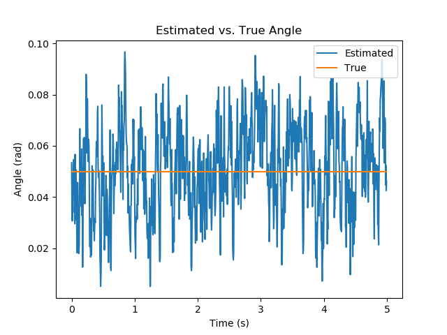
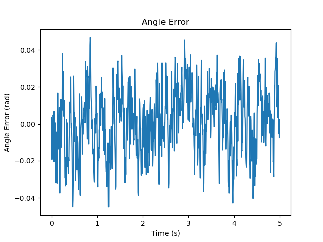
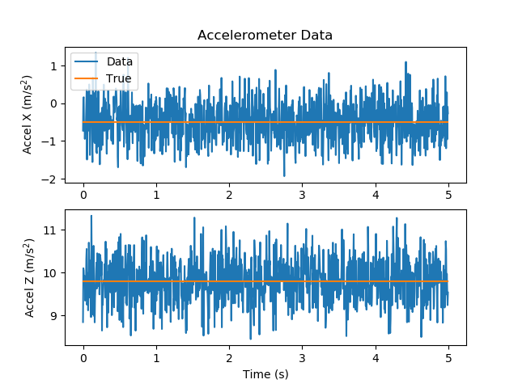
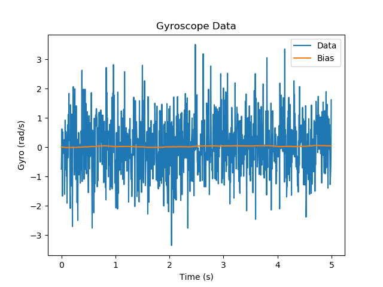

# 2D Complementary Attitude Filter Simulation

This implements a 2D complementary attitude filter for the purposes of analyzing how accelerometer and gyroscope noise affects attitude estimate accuracy.

Supports

* Gaussian accelerometer noise
* Gaussian gyroscope noise
* Brownian motion gyroscope bias drift

Run `python main.py --help` to see a list of available parameters and their default values.

Run `python param_tune.py` to see a plot of attitude error vs. accelerometer weight.

## Sample Results

### Parameter Sweep

Here we attempt to find the best value of the accelerometer weight by plotting the error for a series of values.


We see that the best value of the accelerometer weight is somewhere around 0.05. The sweep can be refined by searching over more values as well as computing standard deviations of the error for each parameter value.

### Low Accel Noise, Low Gyro Noise

```console
python main.py  --gyro-stddev 0.01 --accel-stddev-x 0.01 --accel-stddev-z 0.01
Mean abs error is 0.000424 radians (0.024310 degrees)
```

### Low Accel Noise, High Gyro Noise

```console
python main.py  --gyro-stddev 1.0 --accel-stddev-x 0.01 --accel-stddev-z 0.01
Mean abs error is 0.004991 radians (0.285978 degrees)
```

### High Accel Noise, Low Gyro Noise

```console
python main.py  --gyro-stddev 0.01 --accel-stddev-x 0.5 --accel-stddev-z 0.5
Mean abs error is 0.013562 radians (0.777072 degrees)
```
### High Accel Noise, High Gyro Noise

```console
python main.py  --gyro-stddev 1.0 --accel-stddev-x 0.5 --accel-stddev-z 0.5
Mean abs error is 0.014568 radians (0.834661 degrees)
```

These results suggest that gyroscope additive noise has a much lower effect on attitude error than accelerometer additive noise, likely because all gyroscope measurements are multiplied by the sampling time (dt).





